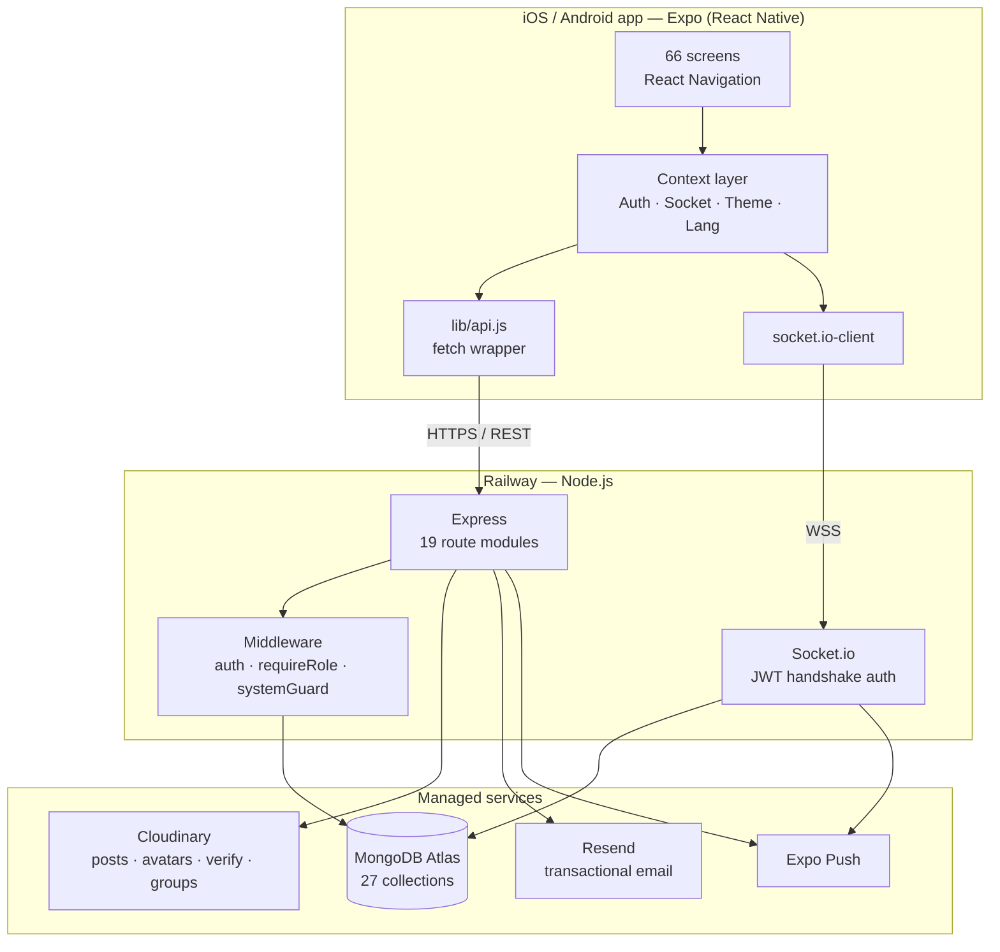

# CaMoim

A community app for Koreans living in Canada — international students, immigrants, and
working-holiday makers. Shipped solo to the App Store and Google Play, live in production
with roughly 300 users.

**iOS + Android · v1.0.7 · Expo (React Native) + Express + MongoDB · deployed on Railway**

[App Store](https://apps.apple.com/app/id6763469709) ·
[Google Play](https://play.google.com/store/apps/details?id=com.hyeonjun122.cahanin)

> The app's UI and code comments are in Korean; this documentation is in English.

---

## What it does

CaMoim moves a long-running Korean-Canadian forum (originally a Daum Café) onto mobile, and
adds the campus features of a Korean university app on top of it.

| Area | What's in it |
|---|---|
| **Boards** | 13 national boards (marketplace, jobs, housing, immigration, currency exchange…) with city filters, rich-text posts, images, bookmarks, likes, anonymous boards |
| **University communities** | Student-ID verification unlocks per-school boards, a school-wide chat lounge, and a student-council-president role with an editable community card. 83 Canadian universities seeded |
| **Groups** | User-created clubs across 6 categories, open or approval-based, with their own group chat and group board. School-restricted clubs are gated on verified enrollment |
| **Real-time chat** | 1:1 DMs with a request/accept handshake, group chats, and school-wide lounges — one Socket.io layer, three room kinds |
| **Business map** | ~580 Korean-owned businesses across Canada with reviews, rankings, and search |
| **Marketplace** | Trade status (`selling` / `sold`) on marketplace-type boards, with rental-specific labels for room listings |
| **Admin console** | In-app moderation: reports, user sanctions, verification review, board/university CRUD, broadcast notices, maintenance mode, forced-update gate |

Bilingual throughout (Korean / English), with light and dark themes.

---

## Architecture



Full write-up, including the real-time message path and the data model:
**[docs/ARCHITECTURE.md](docs/ARCHITECTURE.md)**

---

## Tech choices, in one table

Every row here is a trade-off I made deliberately. The reasoning — and what each choice
cost me — is in **[docs/DECISIONS.md](docs/DECISIONS.md)**.

| Choice | Why | What it cost |
|---|---|---|
| **Expo (managed)** over bare React Native | One person shipping to two stores. EAS Build handles signing; EAS Update ships JS fixes in minutes instead of a week of review | Native patches need `patch-package`; SDK upgrades are all-or-nothing |
| **MongoDB** over PostgreSQL | Boards, groups, and school communities are the same document with different optional fields. Schema churn was constant in the first months | No transactions across collections; referential integrity is my job |
| **Socket.io** over raw WebSocket | Rooms, auto-reconnect, and per-user channels out of the box — all three chat kinds are the same code path | Extra protocol layer; a sticky-session constraint if I ever scale past one instance |
| **Railway** over AWS | Push-to-deploy with zero infra work, which is the right trade for a solo side project | Opaque runtime limits — outbound SMTP is silently blocked (see below) |
| **Cloudinary** over S3 | On-the-fly resizing and CDN delivery without an image pipeline | Vendor lock-in on URL format; a second bill |
| **JWT + `tokenVersion`** | Stateless auth that can still be revoked — bumping the counter invalidates every issued token for that user | Revocation costs a DB read per request |

---

## Engineering deep dives

Four production problems, written up as symptom → investigation → root cause → fix → trade-off.
Full text in **[docs/ENGINEERING-NOTES.md](docs/ENGINEERING-NOTES.md)**.

| # | Problem | One-line root cause |
|---|---|---|
| 1 | **App crashed on opening the map** | React Native's New Architecture interop layer passed `nil` subviews and out-of-range indices into `react-native-maps`' Objective-C view manager during fast marker churn. Fixed with a nil guard and an index clamp, pinned via `patch-package` |
| 2 | **All real-time chat and notifications died after a deploy** | A CORS origin allowlist I added "for security" — native WebSocket clients send a non-empty `Origin` that was never on the list. Security theater on a native-only app, at the cost of the core feature |
| 3 | **Student ID cards were publicly readable** | Verification documents were written to local disk and served by `express.static('/uploads')`. Anyone with the URL could read someone's student ID. Moved to Cloudinary with folder separation and a 90-day purge job |
| 4 | **Signup emails worked locally, timed out in production** | Railway blocks outbound SMTP ports (25/465/587), so Nodemailer hung until `ETIMEDOUT`. Replaced with Resend's HTTPS API on a DKIM-verified domain |

---

## Testing & CI

```
Client unit (jest-expo)      47 tests   ~1s    pure logic, no native
Server unit + integration    59 tests   ~14s   real Express + in-memory MongoDB + real Socket.io
Maestro E2E                   2 flows          real app on a device/emulator
```

[](../../actions/workflows/ci.yml)

The server integration suite spins up the actual Express app and the actual Socket.io server
against a per-run in-memory MongoDB. Only email (Resend) and push (Expo) are mocked —
everything else runs the same code path production does.

The chat suite drives **two real socket clients** through the full round trip: HTTP login →
socket handshake → send → peer receives → message persisted → unread counter incremented →
read receipt propagated. It also covers the failure paths: blocked users, non-participants,
the one-message limit on pending DM requests, and empty-content rejection.

The Maestro flow proves the same round trip through the real UI. `ChatRoomScreen` deliberately
does **not** render optimistically — a bubble only appears when the server echoes the message
back over the socket — so "the text I typed is now on screen" is itself proof that
app → WebSocket → server → MongoDB → broadcast → app all succeeded.

```bash
npm test             # client
npm run test:server  # server
npm run test:all     # both
```

Details: **[docs/TESTING.md](docs/TESTING.md)** · E2E: **[.maestro/README.md](.maestro/README.md)**

---

## Repo layout

```
camoim/
├── App.js                    app root
├── app.json / eas.json       Expo + EAS build config
├── patches/                  patch-package fixes applied at install time
├── src/                      React Native client  (~31k LOC)
│   ├── screens/              66 screens across 14 domains
│   ├── components/           shared UI
│   ├── context/              Auth · Socket · Theme · Lang providers
│   ├── lib/                  api client, i18n, config, storage, analytics
│   ├── navigation/           tab + stack navigators
│   └── constants/            colors, boards, cities, roles
├── server/                   Express backend      (~11k LOC)
│   ├── app.js                Express assembly — no side effects, imported by tests
│   ├── index.js              DB connect → seeds/migrations → socket init → listen
│   ├── socket.js             Socket.io: auth handshake, send/read/join handlers
│   ├── routes/               19 route modules
│   ├── models/               27 Mongoose schemas
│   ├── middleware/           auth · requireRole · systemGuard
│   └── __tests__/            unit + integration
├── .maestro/                 E2E flows
└── docs/                     architecture, decisions, engineering notes, testing
```

---

## Running it locally

```bash
# 1. Client
npm install
npx expo start          # scan the QR with Expo Go, or press i / a

# 2. Server (optional — the client defaults to the deployed Railway backend)
cd server
cp .env.example .env    # fill in MONGODB_URI, JWT_SECRET, Cloudinary, Resend
npm install
npm run dev
```

To point the app at a local backend, flip `USE_LOCAL_SERVER` to `true` in
[src/lib/config.js](src/lib/config.js). The dev-server IP is detected automatically, so
moving between networks needs no edit. Production builds always use Railway regardless of
this flag.

```bash
npm run test:all        # 106 tests
```

---

## Deployment

| Change | Path | Time to users |
|---|---|---|
| Backend | `git push` → Railway auto-deploy | 1–2 min |
| JS-only app change | `eas update --branch production` | Next app launch |
| Native change (new module, permissions, SDK bump) | `eas build` → `eas submit` → store review | Days |

`runtimeVersion` follows `app.json`'s `version`, so bumping the version is an explicit signal
that OTA compatibility with older builds is broken. See
[docs/DECISIONS.md](docs/DECISIONS.md#10-ota-updates-vs-store-builds).
