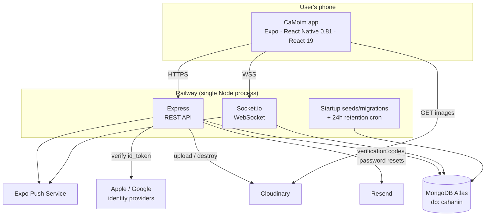
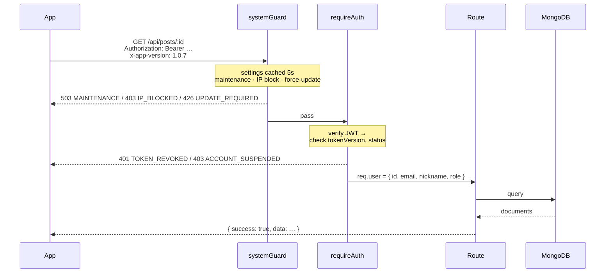
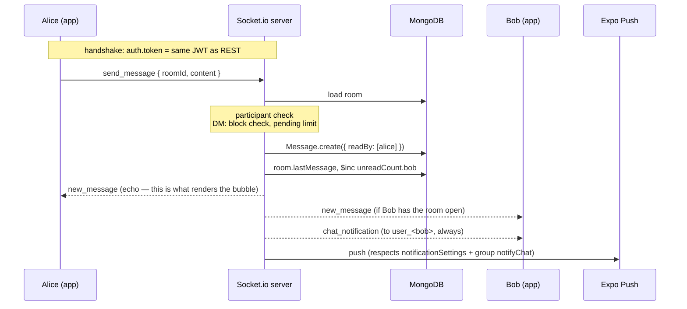
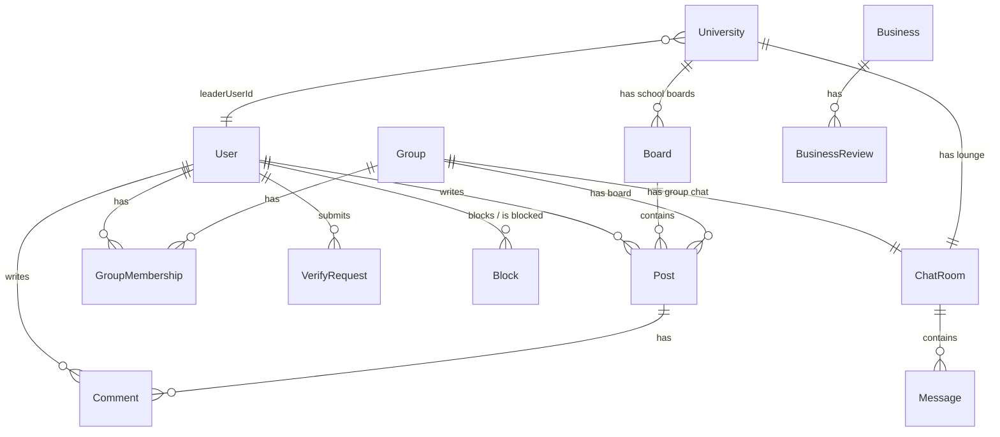
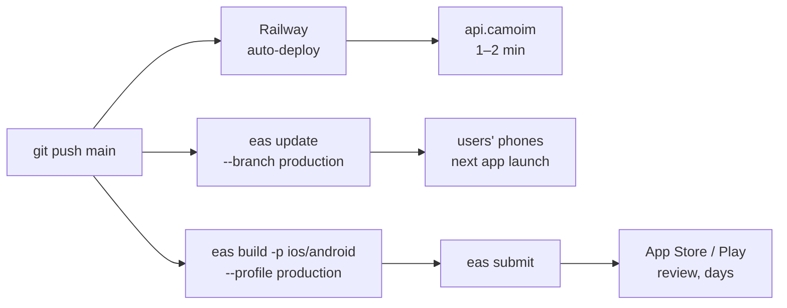

# Architecture

How CaMoim is put together, and why the seams are where they are.

- [System overview](#system-overview)
- [Request path](#request-path)
- [Real-time chat](#real-time-chat)
- [Data model](#data-model)
- [Authentication](#authentication)
- [Media handling](#media-handling)
- [Notifications](#notifications)
- [Operational controls](#operational-controls)
- [Deployment pipeline](#deployment-pipeline)
- [Known limits](#known-limits)

---

## System overview



One Node process serves both the REST API and the WebSocket layer. They share the same
Mongoose models and the same JWT secret, so a token issued by `POST /api/auth/login` is
accepted verbatim by the socket handshake. Everything stateful lives in managed services —
the container itself holds nothing that matters, which is what makes Railway's
deploy-by-restart model safe.

### Client layers

```
screens/          presentation + local state
  ↕
context/          AuthContext · SocketContext · ThemeContext · LangContext
  ↕
lib/api.js        fetch wrapper: token injection, 20s timeout, error normalization,
                  snake_case + _id → camelCase + id
lib/socket        socket.io-client, one connection for the whole app session
```

`SocketContext` owns a single socket for the app's lifetime and multiplexes it with
namespaced listener keys (`on('new_message', 'chatRoom_<id>', fn)`), so screens can subscribe
and unsubscribe without tearing down the connection. The chat list and an open chat room are
both listening to the same socket at the same time.

---

## Request path



Three things are worth calling out.

**Every response is `{ success, data | message, code? }`.** The client's `request()` helper
throws on `!res.ok` and attaches `err.code`, so screens branch on a stable machine-readable
code rather than on a localized message.

**`toCamel` runs on every response.** It rewrites `_id` to `id` and `snake_case` to
`camelCase` recursively. The consequence is a rule the whole client depends on: **front-end
code always reads `obj.id`, never `obj._id`.** A new endpoint that leaks `_id` into a nested
object the client then reads as `_id` produces a silent `undefined`, not an error — which is
exactly why [that conversion is pinned by tests](TESTING.md).

**`systemGuard` runs before authentication.** It has to, because forced-update and
maintenance mode need to reject clients that may not have a valid session. It keeps a 5-second
in-process cache of the `SystemSetting` collection so the admin console can flip maintenance
mode on and have it take effect almost immediately, without a DB read per request.


**Rarely-changing data is cached in process.** The board list (changes a few times a year)
and each user's block list (changes when someone taps "block") were being re-read on nearly
every request, at ~70 ms per round trip. [`utils/cache.js`](../server/utils/cache.js) holds
them with a TTL, coalesces concurrent lookups for the same key, and uses a generation counter
so a read in flight during an invalidation can't write stale data back. Invalidation lives in
**Mongoose post-hooks on the `Board` and `Block` models**, so every write path clears the
cache without route handlers having to remember to.
---

## Real-time chat

Three kinds of room share one implementation:

| `ChatRoom.kind` | Participants | Distinguishing field | Handshake |
|---|---|---|---|
| `dm` | 2 | `requesterId`, `otherSnapshot` | starts `pending` — the requester may send exactly one message until the recipient accepts |
| `group` | N | `groupId`, `groupName` | starts `accepted`; membership syncs into `participants` |
| `school` | N | `university` | starts `accepted`; one room per university, lazily created on first visit |

`group` and `school` are grouped as `isMultiUser` in the send handler, which is how the
DM-only checks (chat blocks, the pending one-message limit) get bypassed for them without
duplicating the handler.

### Sending a message



**The client does not render optimistically.** `sendMessage()` clears the input and emits;
the bubble is drawn only when `new_message` comes back. That costs a round trip of perceived
latency, and buys two things: the UI can never show a message that failed to persist, and a
single-device E2E test that asserts "my text appeared" is transitively asserting that the
socket, the server, the database write, and the broadcast all worked.

**Chat messages do not create `Notification` records.** Unread state lives in
`ChatRoom.unreadCount` (a `Map<userId, count>`) and surfaces as the chat tab badge; the
push is fire-and-forget. This is the WhatsApp/KakaoTalk pattern, and it avoids the
double-counting bug where a message shows up both in the notification inbox and in the chat
badge. `GET /api/notifications` filters out legacy `chat` / `group_chat` records, and
`calculateUnreadBadge` excludes them from the app icon count.

**Every socket auto-joins `user_<id>`** on connect. That's the per-user channel used for
`chat_notification` and read receipts, so a user gets notified about rooms they aren't
currently viewing.

---

## Data model

27 collections. The ones that carry the domain:



Three modelling decisions do most of the work:

**`Post` belongs to a `Board` or a `Group`.** A pre-validate hook rejects any post with
neither `boardId` nor `groupId` set, and the write paths only ever set one. This lets group
boards reuse the entire post, comment, like, bookmark, and report stack rather than growing a
parallel one. (The hook enforces *at least* one rather than *exactly* one — tightening that is
on the list.)

**`University` is the single source of truth for schools.** `name` is the join key used by
`User.university`, `Board.university`, and `ChatRoom.university` — deliberately a string, not
an ObjectId, because it predates the `University` collection and migrating live user records
in place was riskier than living with a denormalized key. A startup seed upserts all 83
universities idempotently, and `leaderUserId` (the student council president) is lazily
re-validated on read: if that user unverifies, leaves, or transfers schools, the field is
cleared on the next community fetch rather than by a cleanup job.

**`ChatRoom.unreadCount` is a `Map`, not a subdocument array.** Incrementing one participant's
counter is a single `$inc` on `unreadCount.<userId>` — applied atomically by MongoDB, so it
stays correct when several people send into a group room at once. (An earlier version read the
current count and wrote back `count + 1`, which lost increments under concurrency; a test that
fires 20 simultaneous sends now pins the fix.)

---

## Authentication

Three entry points converge on the same JWT:

```
email + password  ─┐
Sign in with Apple ─┼─→  User document  ─→  jwt.sign({ id, email, nickname, v: tokenVersion })
Google Sign-In    ─┘
```

Social accounts auto-link by verified email, so someone who signed up with a password and
later taps "Continue with Apple" lands in the same account. An account created purely
through a social provider has `passwordHash: null`; password login on it returns
`SOCIAL_ONLY` with the provider name rather than a generic failure.

A social sign-in for an unknown email doesn't create a user directly — it returns a
short-lived `preRegToken`, and the app collects nickname/role/city before
`POST /auth/social-complete` commits the account. That keeps the "every user has a unique
nickname" invariant true at creation time.

**Revocation.** `User.tokenVersion` is embedded in the token as `v` and compared on every
authenticated request — and on every socket handshake, so a revoked, banned, or suspended
account can't keep a chat connection open either. A password change or reset increments it,
which invalidates every outstanding token for that user and returns `TOKEN_REVOKED` — the
client treats that code as "log out and show the login screen". This is the one place the design pays a DB read per
request to avoid a refresh-token dance.

**Brute force.** Five consecutive failures lock the account for 30 minutes
(`failedLoginCount` / `lockedUntil`, returning `423`), on top of an IP-level rate limit of
10 login attempts per 15 minutes.

**Authorization** is two middlewares: `requireRole(...roles)` re-reads the role from the
database rather than trusting the token's claims (so a demotion takes effect immediately),
and `requireVerifiedStudent` additionally demands `verified === true`.

---

## Media handling

All uploads go to Cloudinary via `multer-storage-cloudinary`. Nothing is ever written to the
container's disk — Railway's filesystem is ephemeral, and (as
[engineering note #3](ENGINEERING-NOTES.md#3-student-id-cards-were-publicly-readable)
describes) serving it statically leaked student ID cards.

| Folder | Contents | Retention |
|---|---|---|
| `camoim/posts` | post images | lifetime of the post |
| `camoim/avatars` | profile pictures | lifetime of the account |
| `camoim/groups` | group cover images | lifetime of the group |
| `camoim/verify` | **student ID / enrollment documents** | **90 days after review** |

`verifyCleanup.js` runs 30 seconds after boot and every 24 hours after that. It finds
`VerifyRequest` documents reviewed more than 90 days ago, destroys the Cloudinary asset, and
blanks `fileUrl` — but keeps the record itself, so the audit trail of who was verified and
when survives the document being destroyed. `pending` requests are never touched; an admin
may still be looking at them.

Rich-text post bodies are stored as HTML. Lists are served a pre-stripped preview
(`toContentPreview`) computed server-side so the client never downloads a 10 KB body to show
two lines of it.

---

## Notifications

Two independent channels, deliberately not unified:

| | Notification inbox | Push |
|---|---|---|
| Backed by | `Notification` collection | Expo Push Service |
| Covers | comments, replies, likes, group approvals, student-council appointments, chat *requests* | everything above **plus** chat messages |
| Chat messages | **excluded** | included |

The app icon badge is computed by `calculateUnreadBadge` as unread notifications (excluding
chat types) plus the sum of `ChatRoom.unreadCount` — so a chat message increments the badge
exactly once, via the chat side.

Per-user `notificationSettings` gates push at send time (a master toggle plus per-type flags),
and group chats have an additional per-membership `notifyChat` flag so a member can mute one
noisy group without muting chat entirely.

---

## Operational controls

The admin console is part of the app, not a separate deployment. Beyond moderation, three
controls affect every client:

- **Maintenance mode** — `systemGuard` returns `503 MAINTENANCE` to everything except
  `/api/admin` and `/api/auth/login`, so an admin can still get in while the app is down.
- **Forced update** — clients send `x-app-version`; below `forceUpdate.minVersion` they get
  `426 UPDATE_REQUIRED` and the app shows an update wall. This is the escape hatch for a bug
  that OTA can't fix.
- **IP blocking** — an allowlist-free denylist checked ahead of auth.

All three live in the `SystemSetting` collection behind the same 5-second cache.

---

## Deployment pipeline



Railway's root directory is set to `server/`, because the repo also holds the Expo app.
`.easignore` does the mirror-image exclusion so EAS never uploads the backend.

The OTA channel (`production`) matches the EAS build channel of the same name, and
`runtimeVersion` follows `app.json`'s `version`. Bumping the version is therefore an explicit,
visible declaration that OTA compatibility with shipped builds is broken — you cannot
accidentally push JS that a native build can't run. The full rule for what can and can't go
over OTA is in [DECISIONS.md](DECISIONS.md#10-ota-updates-vs-store-builds).

---

## Known limits

Written down because pretending they don't exist is worse than owning them.

- **Single instance.** Socket.io state is in-process, so horizontal scaling needs a Redis
  adapter before a second container. The same goes for the in-process caches: a write clears
  them only in the process that made it, so a second instance would serve a stale block list
  for up to 30 seconds and a stale board list for up to 60. Fine at current load, and a known
  step, not a surprise.
- **App server and database in different regions.** Production measurements put every MongoDB
  round trip at ~70 ms, where a same-region pair would see 1–3 ms. The code now minimizes
  *sequential* queries per request, which cut the home feed and chat latency roughly in half
  ([perf/README.md](../perf/README.md)), but co-locating the two would take the database out of
  the latency budget entirely — server-side home feed 156 ms → 9 ms in the benchmark.
- **No cross-collection transactions.** Cascading deletes (post → comments → bookmarks) are
  sequential writes. A crash mid-cascade leaves orphans; the read paths tolerate them, but
  they're not cleaned up.
- **`0.0.0.0/0` on Atlas network access.** Railway doesn't publish stable outbound IPs on the
  current plan. Mitigated by credentials and TLS, not by network policy.
- **Denormalized university names.** `User.university` is a display string. Renaming a
  university means a migration across four collections (there's a script for it), which is the
  price of not having migrated to ObjectId references early.
- **Search is a regex scan.** `unifiedSearch` runs `$regex` across posts, groups, and users.
  It's correct and it's fast enough at this size; it won't be at 10×.
- **No APM.** There's a lightweight `AnalyticsEvent` collection, `DailyActive` tracking, and
  client-side performance telemetry (`perf_*` events — cold start, feed load, chat round trip),
  but no distributed tracing or error aggregation service. Production debugging is
  log-reading.
